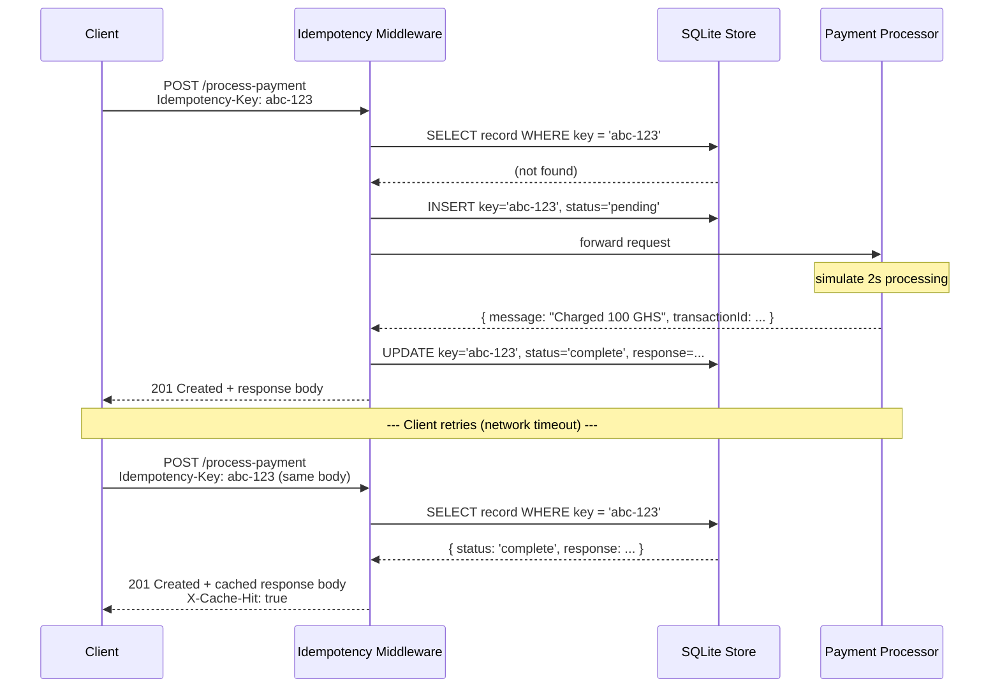
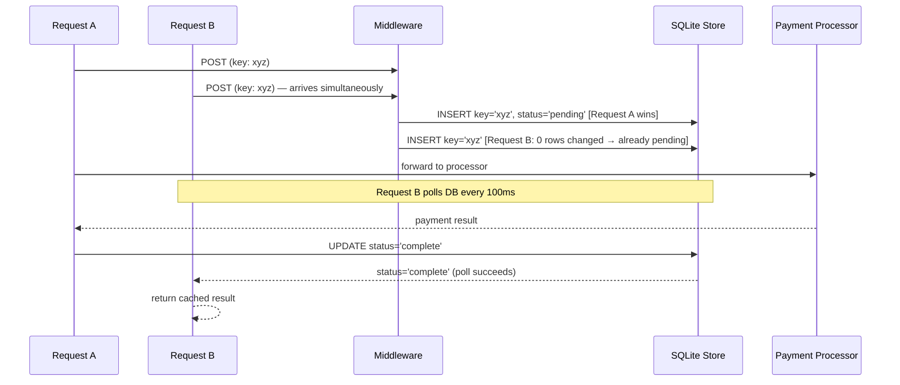

# Idempotency Gateway

A payment-processing API that makes sure every transaction is charged **exactly once** regardless of how many times the client retries a request.

Built with **Node.js**, **Express**, and **SQLite**

---

## Architecture Diagram

### In-Flight Race Condition

