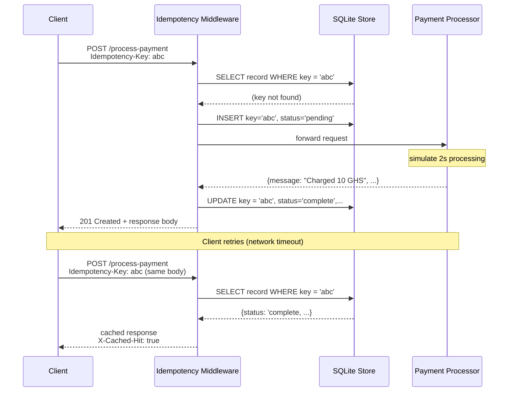
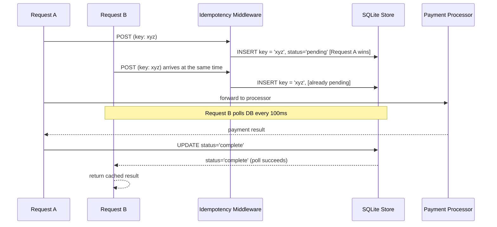

# Idempotency Gateway
This is a payment processing API that makes sure every transaction is charged exactly once despite how many times a client retries a request.

## The Architecture Diagram


### In-Flight Race Condition


## Setup
```bash
git clone https://github.com/xxnoodl/Idempotency-Gateway.git
cd Idempotency-Gateway
npm install
npm start
```

The server starts on `localhost:3000` by default

## API Documentation

### `POST /process-payment`

**Headers**

| Header | Required | Description|
|-|-|-|
| `Content-Type` | Yes | Must be `application/json` |
|`Idempotency-Key` | Yes | A unique string identifying payment attempt|

**Request Body**

```json
{
    "amount": 100,
    "currency": "GHS"
}
```

### Response Reference
#### `201 Created`: payment processed

```json
{
    "message": "Charged 100 GHS",
    "transactionId":"49295a7e-2c73-4629-9461-5eba8acaa910",
    "timestamp":"2026-05-30T10:45:53.385Z"
}
```
#### `201 Created`: replayed response (duplicate request)
Same body as first response, Includes the header: `X-Cache-Hit: true`
No processing delay, returned immediately.

#### `409 Conflict`: key reused with different request body
```json

{"error":"Idempotency key already used for a different request body."}
```
#### 400 Bad Request: Missing `Idempotency-Key` header
```json
{"error":"Missing required header: Idempotency-Key"}
``` 

### Example: curl
**First request**

```bash
curl -i -X POST http://localhost:3000/process-payment \
-H "Content-Type: application/json" \
-H "Idempotency-Key: abc" \
-d '{"amount": 100, "currency": "GHS"}'
```


**Second request (same key, same body)**
```bash
curl -i -X POST http://localhost:3000/process-payment \
-H "Content-Type: application/json" \
-H "Idempotency-Key: abc" \
-d '{"amount": 100, "currency": "GHS"}'
```

**conflict (same key, different body)**
```bash
curl -i -X POST http://localhost:3000/process-payment \
-H "Content-Type: application/json" \
-H "Idempotency-Key: abc" \
-d '{"amount": 500, "currency": "GHS"}'
```
## Design Decisions
**SQLite via `node:sqlite`**
Node.js v22.5+ ships with native SQLite module. Using it avoid any native complication step. The server starts with `npm install && npm start` on any supported Node version, with no build tools needed.

SQLiet runs in WAL mode for better concurrent-read performance.

### Request Body Hashing
Idempotency requires detecting when two requests share a key but carry different payloads. The body is hashed with SHA-256 after standardizing the JSON.

### In-Flight Race Condition
The store uses a `status` column with two states: `pending` (being processed) and `complete`. 
When a request arrives, it attempts `INSERT OR IGNORE`. If `changes = 1`, it won the race and owns processing. If `changes = 0`, anothe request is already in-flight. This request polls the DB every 100ms up to 30s until `status = 'complete'`, then returns the cached result.
SQLite serializes all writes so there's no window for two requests to both see `changes = 1`.

## Developer's Choice: Idempotency Key Expiration (24 hour TTL)

## What it does
Every key written to the store is stamped with an  `expires_at` timestamp that is set to 24 hours from when it was created.
keys that expire are filted out all lookups and purged from the database on startup and once per hour via a background interval.

## Importance
Without expiry, idempotency keys accumulate forever; that's a memory leak in disguise.
In a real life fintech environment, this could pose dangers like replay attacks. Furthemore, it is good for compliance and operational hygiene (the store size stays bounded without any manual intervention).