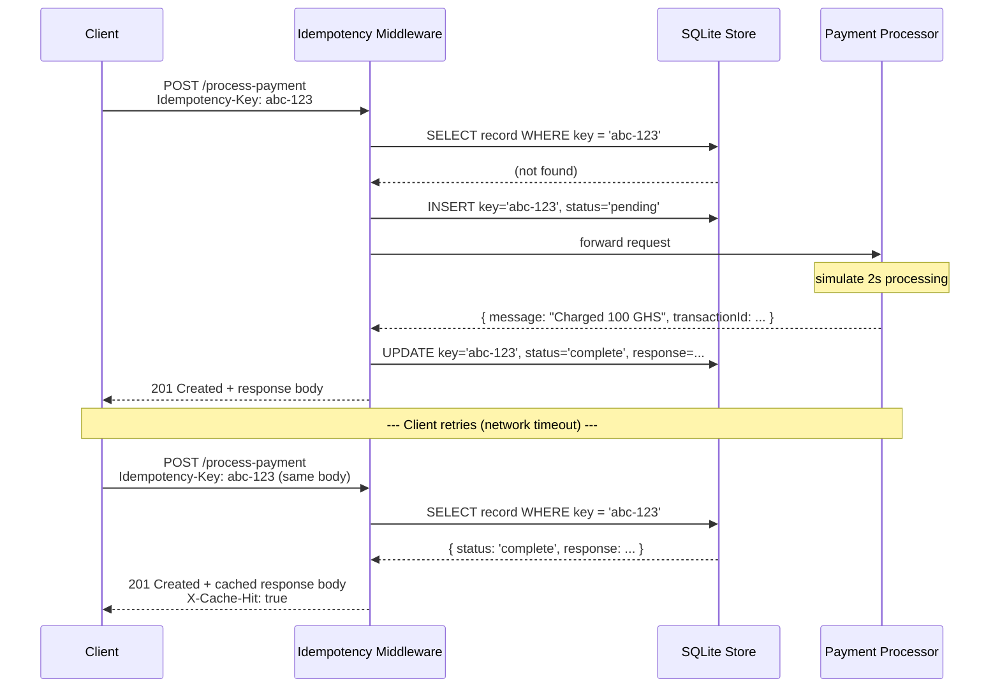
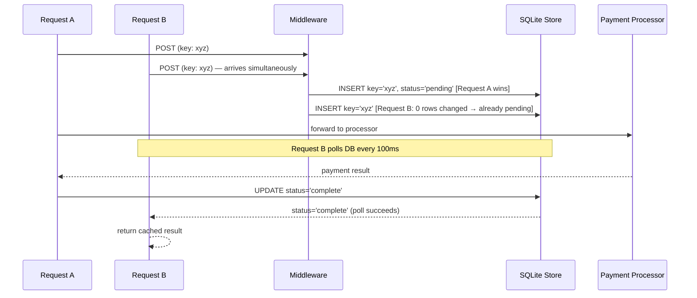

# Idempotency Gateway

A payment-processing API that makes sure every transaction is charged **exactly once** regardless of how many times the client retries a request.

Built with **Node.js**, **Express**, and **SQLite**

---

## Architecture Diagram



### In-Flight Race Condition



---

## Setup

**Requirements:** Node.js v22.5.0 or later (uses the built-in `node:sqlite` module).

```bash
git clone https://github.com/xxnoodl/Idempotency-Gateway.git
cd Idempotency-Gateway
npm install
npm start
```

The server starts on `http://localhost:3000` by default.  
Set the `PORT` environment variable to use a different port:

```bash
PORT=8080 npm start
```

---

## API Documentation

### `POST /process-payment`

Process a payment. Protected by idempotency — the same key always returns the same result.

**Headers**

| Header            | Required | Description                                         |
|-------------------|----------|-----------------------------------------------------|
| `Content-Type`    | Yes      | Must be `application/json`                          |
| `Idempotency-Key` | Yes      | A unique string identifying this payment attempt    |

**Request Body**

```json
{
  "amount": 100,
  "currency": "GHS"
}
```

| Field      | Type   | Description                     |
|------------|--------|---------------------------------|
| `amount`   | number | Positive number — amount to charge |
| `currency` | string | ISO currency code (e.g. `GHS`)  |

---

### Response Reference

#### `201 Created` — Payment processed (first request)

```json
{
  "message": "Charged 100 GHS",
  "transactionId": "f3c91f5d-4f45-42a0-a041-db9f2d4fe8ee",
  "timestamp": "2026-05-30T04:24:41.817Z"
}
```

#### `201 Created` — Replayed response (duplicate request)

Same body as the first response. Includes the header:

```
X-Cache-Hit: true
```

No processing delay — returned immediately from the store.

#### `409 Conflict` — Key reused with a different request body

```json
{
  "error": "Idempotency key already used for a different request body."
}
```

#### `400 Bad Request` — Missing `Idempotency-Key` header

```json
{
  "error": "Missing required header: Idempotency-Key"
}
```

---

### Example: curl

**First request**
```bash
curl -X POST http://localhost:3000/process-payment \
  -H "Content-Type: application/json" \
  -H "Idempotency-Key: order-7829-attempt-1" \
  -d '{"amount": 100, "currency": "GHS"}'
```

**Retry (same key, same body)**
```bash
curl -i -X POST http://localhost:3000/process-payment \
  -H "Content-Type: application/json" \
  -H "Idempotency-Key: order-7829-attempt-1" \
  -d '{"amount": 100, "currency": "GHS"}'
# Response headers will include: X-Cache-Hit: true
```

**Conflict (same key, different body)**
```bash
curl -X POST http://localhost:3000/process-payment \
  -H "Content-Type: application/json" \
  -H "Idempotency-Key: order-7829-attempt-1" \
  -d '{"amount": 500, "currency": "GHS"}'
# → 409 Conflict
```

---

## Design Decisions

### SQLite via `node:sqlite` (built-in)

Node.js v22.5+ ships a native SQLite module (`node:sqlite`). Using it avoids any native compilation step — the server starts with `npm install && npm start` on any supported Node version, with no build tools required.

SQLite runs in WAL (Write-Ahead Logging) mode for better concurrent-read performance.

### Request Body Hashing

Idempotency requires detecting when two requests share a key but carry different payloads. The body is hashed with SHA-256 after canonicalising the JSON (keys sorted alphabetically), so `{"a":1,"b":2}` and `{"b":2,"a":1}` are treated as identical.

### In-Flight Race Condition

The store uses a `status` column with two states: `pending` (being processed) and `complete`. When a request arrives:

1. It attempts `INSERT OR IGNORE` — if `changes = 1`, it won the race and owns processing.
2. If `changes = 0`, another request is already in-flight. This request polls the DB every 100 ms (up to 30 s) until `status = 'complete'`, then returns the cached result.

Because SQLite serialises all writes, there is no window for two requests to both see `changes = 1`.

### Response Interception

Rather than duplicating response logic between the route and the middleware, the middleware wraps `res.json()` before calling `next()`. The route handler runs normally; the wrapper intercepts the response body and status code, persists them to the store, and then forwards to the original `res.json`.

---

## Developer's Choice: Idempotency Key Expiration (24-hour TTL)

### What it does

Every key written to the store is stamped with an `expires_at` timestamp set to **24 hours from creation**. Expired keys are:

- Filtered out of all lookups (treated as if they never existed).
- Purged from the database on startup and once per hour via a background interval.

### Why it matters

Without expiry, idempotency keys accumulate forever — a memory/disk leak in disguise. More critically, in a real Fintech environment:

- **Replay attacks**: A malicious or buggy client could re-submit a key weeks later and expect the old response to be honoured. A TTL ensures keys can only be replayed within a sensible window.
- **Compliance**: Payment regulations often require that retry windows are bounded (e.g., PCI-DSS guidance on reconciliation windows).
- **Operational hygiene**: The store size stays bounded without any manual intervention.

The 24-hour window is a common industry default (Stripe uses 24 hours). It can be adjusted by changing the `TTL_SECONDS` constant in `src/db.js`.
